# Variations

- Night [#iroh-the-cat-night-theme]
- Midnight [#iroh-the-cat-midnight-theme]

# Iroh the Cat Night Theme

<br><br>Iroh the Cat Night theme. A clean Visual Studio Code theme named after my cat [Night theme.]

### Theme variations based on language

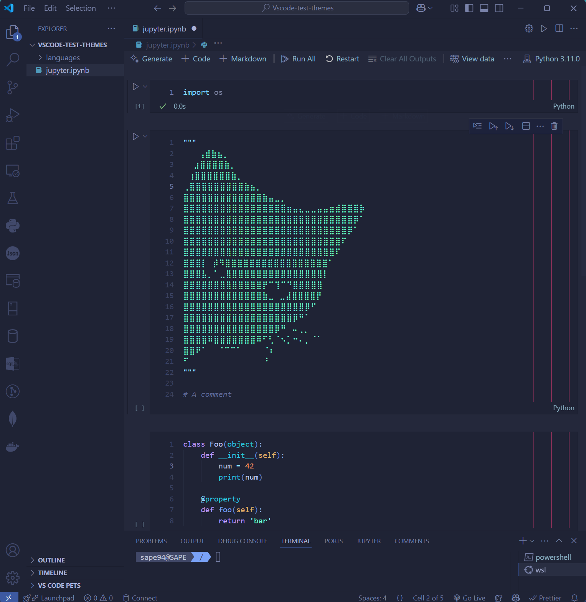

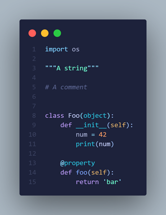

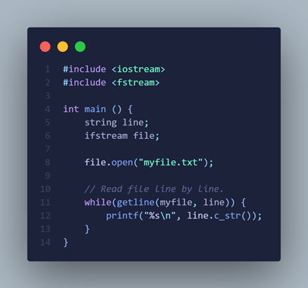

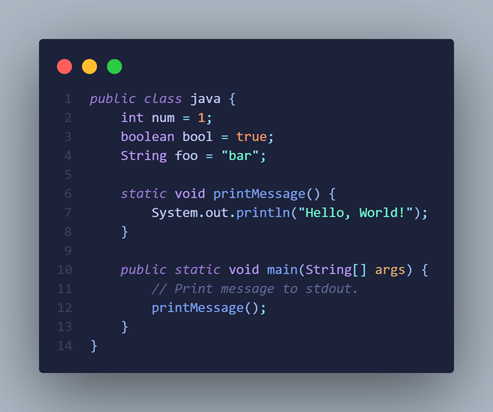

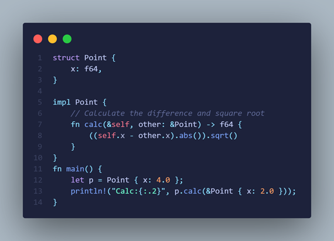

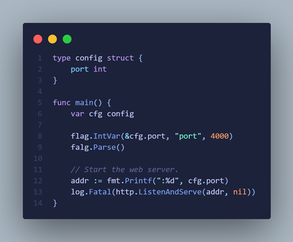

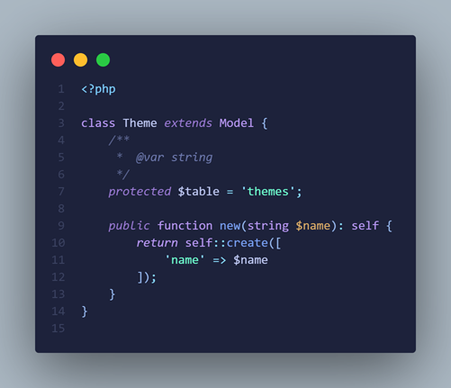

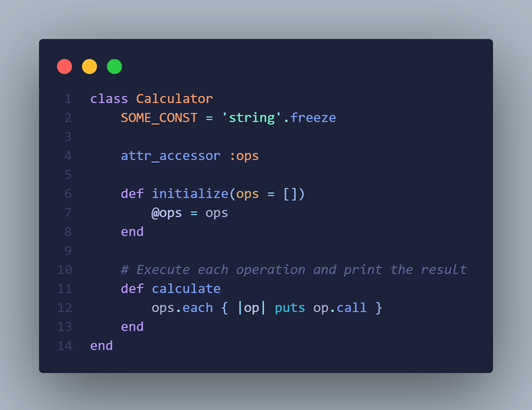

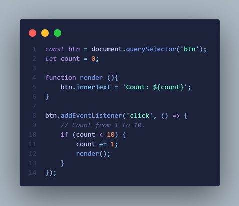

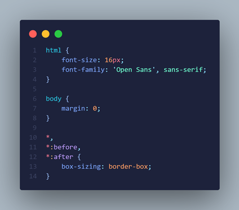

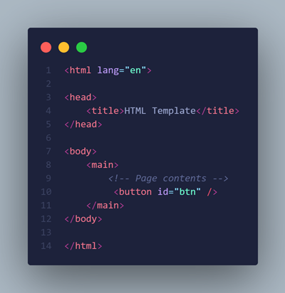

# Iroh the Cat Midnight Theme

<br><br>Iroh the Cat Midnight theme. A clean Visual Studio Code theme named after my cat [Midnight theme.]

### Theme variations based on language

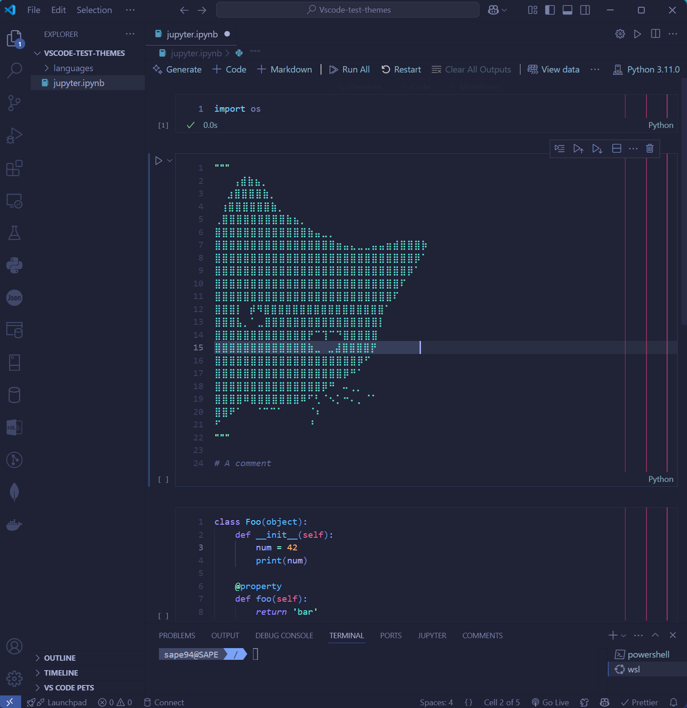

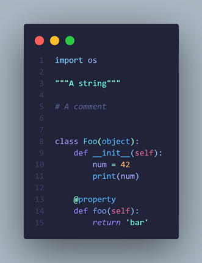

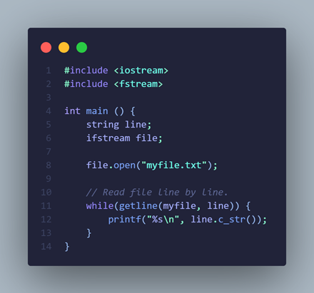

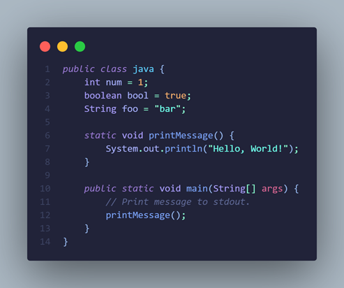

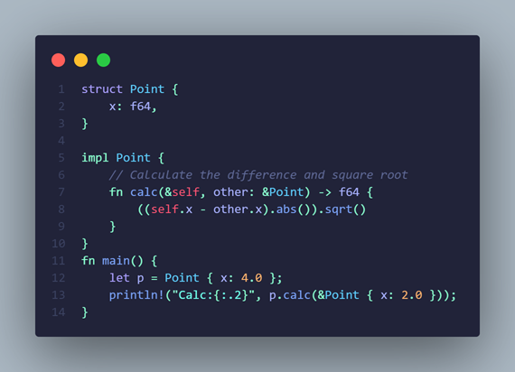

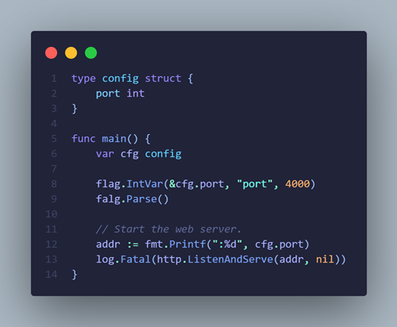

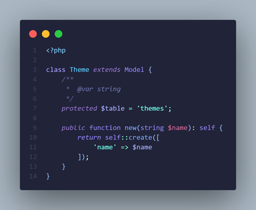

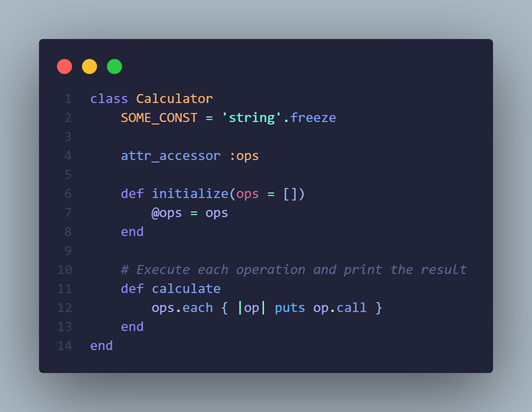

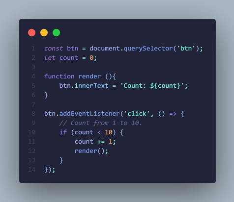

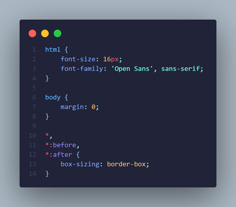

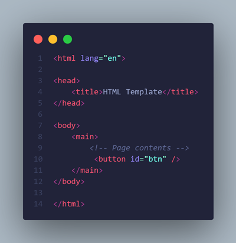

## Iroh the cat

Illustration of Iroh.


If you are into good practices add some theme-colored editor rulers to your vscode code as these ones:

```python
"editor.rulers": [
{
"column": 79,
"color": "#ff40806f"
},
{
"column": 83,
"color": "#ff4080a8"
},
{
"column": 87,
"color": "#ff4080e1"
}
]
```

### For more information

- [Github repo](https://github.com/sape94/iroh-the-cat-night)

**Enjoy!**
